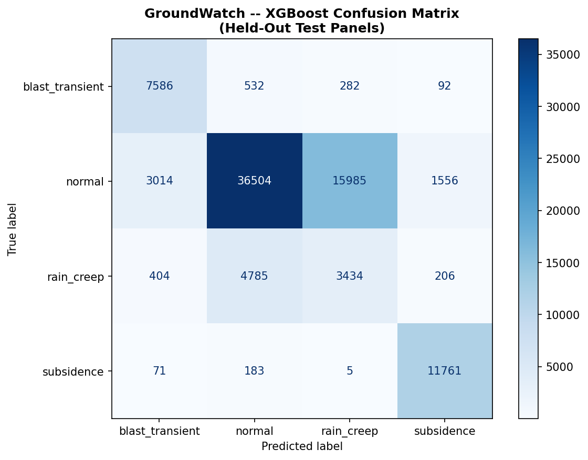

# GroundWatch -- Model Evaluation Report

## Test Configuration
- **Test panels**: panel_017, panel_018
- **Total test windows**: 86,400
- **Features used**: 17
- **Models**: Isolation Forest (anomaly) + XGBoost (classifier)

## Overall Performance
- **Accuracy**: 0.6862 (68.6%)
- **False-Alarm Rate**: 0.0172 (298/17321 confounders misclassified as subsidence)

## Per-Class Metrics

| Class | Precision | Recall | F1-Score | Support |
|-------|-----------|--------|----------|---------|
| blast_transient | 0.6850 | 0.8933 | 0.7754 | 8492 |
| normal | 0.8691 | 0.6398 | 0.7370 | 57059 |
| rain_creep | 0.1743 | 0.3889 | 0.2407 | 8829 |
| subsidence | 0.8638 | 0.9785 | 0.9176 | 12020 |

## Confusion Matrix

## Risk Score Distribution

| True Class | Mean Score | Std | Median |
|------------|-----------|-----|--------|
| blast_transient | 18.7 | 8.1 | 19.5 |
| normal | 7.7 | 9.4 | 4.4 |
| rain_creep | 7.2 | 8.5 | 4.7 |
| subsidence | 84.1 | 11.2 | 86.3 |

## Key Observations

1. **Subsidence detection**: The XGBoost classifier is trained to discriminate true subsidence from confounders (blast transients, rain creep).
2. **False-alarm rate**: Measures how often blast/rain events are incorrectly classified as subsidence -- the critical safety metric.
3. **Panel-level split**: Test panels were NOT seen during training, ensuring the model generalises to unseen panel geometries.
4. **Model size**: XGBoost's histogram-based trees serialize to 2-4 MB, comfortably under the 5MB edge-deployment limit that the previous Random Forest model exceeded.

---
*Generated by GroundWatch evaluation pipeline*